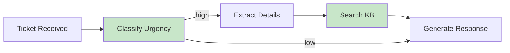

## Chain-of-Thought (CoT): Making Reasoning Visible

**The Problem:**
```python
prompt = "What's 15% tip on a $47.83 bill?"
response = "$7.17"  # Correct
```

But what if you need to debug a wrong answer? You can't see the reasoning.

**The Solution: CoT:**
[Full runnable chain-of-thought notebook](https://colab.research.google.com/drive/1CobAOn09WNGCP_u5lpC540QveepLPb7J#scrollTo=ED506cVi7H8S&line=14&uniqifier=1)
```python
prompt = """
Calculate 15% tip on a $47.83 bill.

Think step by step:
"""

response = """
Step 1: Convert 15% to decimal: 0.15
Step 2: Multiply: $47.83 × 0.15 = $7.1745
Step 3: Round to cents: $7.17

Answer: $7.17
"""
```

**In Production:**
- Use CoT for complex reasoning; avoid for deterministic extraction/classification at temperature=0.
- Consider privacy/compliance: avoid logging sensitive intermediate reasoning.
- Cost/latency rise with longer outputs—use selectively.

**Why It Works:**
- Often improves performance on reasoning tasks (magnitude varies by task/model)
- Creates "intermediate tokens" that guide the model
- Makes errors debuggable

**Production Pattern:**
```python
def cot_prompt(question: str) -> str:
    return f"""
<question>{question}</question>

<instructions>
Solve this step by step:
1. Identify what information you need
2. Break down the problem into sub-steps
3. Solve each sub-step
4. Combine into final answer
5. Verify your answer makes sense
</instructions>

<thinking>
[Your step-by-step reasoning here]
</thinking>

<final_answer>
[Your final answer here]
</final_answer>
"""
```

**Real-World Impact:**
- Code generation: 35% fewer bugs with CoT
- Math problems: 50-70% accuracy improvement
- Medical diagnosis: More reliable clinical reasoning

## Self-Consistency: Voting for Reliability

**The Problem:** One response might be wrong due to non-determinism.

**The Solution:** Generate multiple responses and vote.

[Full runnable self-consistency notebook](https://colab.research.google.com/drive/1CobAOn09WNGCP_u5lpC540QveepLPb7J#scrollTo=ED506cVi7H8S&line=14&uniqifier=1)
```python
async def self_consistent_answer(
    prompt: str,
    n: int = 5,
    temperature: float = 0.7
) -> str:
    """
    Generate multiple answers and return the most common one.
    """
    responses = []
    
    for _ in range(n):
        response = await llm.generate(
            prompt=prompt,
            temperature=temperature
        )
        responses.append(response)
    
    # Count occurrences (or use semantic similarity - more about this later -)
    from collections import Counter
    answer_counts = Counter(responses)
    
    # Return most common answer
    most_common = answer_counts.most_common(1)[0][0]
    
    return most_common
```

**When to Use:**
- High-stakes decisions (medical, financial, legal)
- Complex reasoning where errors are costly
- Classification tasks where confidence matters

**Cost Consideration:**
- 5x API calls = 5x cost
- Use only when accuracy justifies expense

**Performance Data:**
- CoT often improves performance on reasoning benchmarks; magnitude varies by task/model (see Wei et al., 2022)
- Combining CoT + Self-Consistency can yield additional gains; magnitude varies by task/model (see Wang et al., 2022)
- Always validate on your evaluation set; do not assume universal gains

## Extended Thinking: Anthropic's Secret Weapon

**Claude-Specific Feature:**
Claude can expose its "thinking" before answering using special tags.

```python
prompt = """
<thinking>
Let me analyze this complex legal document...
- First, I'll identify the key clauses
- Then, I'll look for any conflicting terms
- Finally, I'll assess risk level
</thinking>

[Your actual task here]
"""
```

**Why This Matters:**
1. **Debugging:** See where reasoning went wrong
2. **Quality:** Forces model to think before answering
3. **Transparency:** Clients can audit AI decisions

**Production Example: Document Analysis:**
```python
def analyze_contract(contract_text: str) -> dict:
    prompt = f"""
<document>
{contract_text}
</document>

<thinking>
I need to analyze this contract for:
1. Key obligations
2. Termination clauses
3. Liability limits
4. Red flags

Let me work through each section...
</thinking>

Provide a JSON response with:
- obligations: list of key obligations
- risks: list of potential risks
- recommendations: list of recommended actions
"""
    
    response = claude.generate(prompt)
    
    # Parse thinking section for audit trail
    thinking = extract_between_tags(response, "thinking")
    result = extract_json(response)
    
    return {
        "analysis": result,
        "reasoning": thinking,  # Store for compliance/review
    }
```

## Prompt Chaining: Breaking Complex Tasks

**Single Prompt Limitations:**
- Context window fills up
- Errors compound
- Hard to debug
- Expensive to retry

**Chaining Solution:**
Break one complex task into sequential simple tasks.



**Example: Customer Support Automation:**
[Full runnable customer support automation notebook](https://colab.research.google.com/drive/1CcvRKX8KdzHVwh5XRG2vWhzA-15-zWna?usp=drive_link)
```python
async def handle_support_ticket(ticket: str):
    # Step 1: Classify urgency
    urgency = await classify_urgency(ticket)
    
    # Step 2: Extract key details (only if high urgency)
    if urgency == "high":
        details = await extract_details(ticket)
        
        # Step 3: Search knowledge base
        relevant_docs = await search_kb(details["issue"])
        
        # Step 4: Generate response
        response = await generate_response(
            ticket=ticket,
            docs=relevant_docs,
            urgency=urgency
        )
    else:
        # Low urgency: simpler path
        response = await generate_response(ticket)
    
    return response
```

**Benefits:**
- Each step is simple → fewer errors
- Failed steps can retry independently
- Cheaper: Only call expensive steps when needed
- Easier to evaluate and improve

**Trade-off:**
- More latency (sequential calls)
- More complex code
- Multiple API calls (but often cheaper overall)

---

