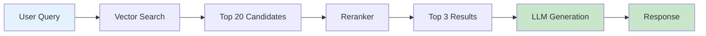

# Course Design Guideline
## Practical Gen AI Engineering: Building Production-Ready AI Agents

**Purpose:** This guideline ensures consistency, quality, and pedagogical effectiveness across all course modules. Use this as your reference when creating any course content.

---

## 1. Voice & Tone

### Core Principles

**Professional but Approachable**
- Write like a senior engineer mentoring a teammate, not a professor lecturing
- Use "we" and "you" to create partnership ("Let's build this together")
- Acknowledge complexity without being intimidating
- Celebrate small wins and learning from failures

**Production-Focused Realism**
- Lead with real-world constraints and trade-offs
- Every concept should answer: "Why does this matter in production?"
- Use actual failure cases, not sanitized textbook examples
- Acknowledge uncertainty when the field is evolving

**Confident but Humble**
- Be direct about what works vs. what's theoretical
- Use phrases like "Industry data shows..." rather than "I think..."
- Admit when something is hard: "This is tricky, and even experienced teams struggle here"
- Avoid absolutes: "usually", "often", "typically" over "always", "never"

### Voice Examples

❌ **Too Academic:** "The implementation of retrieval-augmented generation necessitates a comprehensive understanding of vector similarity metrics."

✅ **Just Right:** "RAG works by finding the most relevant documents for your query. Think of it like a smart search engine that feeds results to your LLM."

❌ **Too Casual:** "Yo, so hallucinations are super annoying lol but here's how to deal with them..."

✅ **Just Right:** "Hallucinations are frustrating, but they're a fundamental limitation we can manage. Here's how production teams handle them."

### Tone by Section Type

**Introducing Concepts:** Welcoming, contextual
> "Before we dive into implementation, let's understand *why* this pattern emerged. It solves a specific problem that teams kept hitting..."

**Technical Deep Dives:** Clear, precise, patient
> "This might look complex at first. Let's break it down step by step, starting with the simplest case."

**Troubleshooting/Debugging:** Empathetic, systematic
> "If you're seeing this error, you're not alone - it's a common stumbling block. Here's how to diagnose it."

**Production Lessons:** Direct, evidence-based
> "Industry data from 50+ enterprise deployments shows that orchestrated agents cost 4-15x less. Let's see why."

---

## 2. Content Structure

### Module Organization Pattern

Every module follows this structure:

```
1. Overview & Context (Why This Matters)
   - Real-world problem this solves
   - Industry context and adoption
   - Preview of key concepts

2. Foundational Concepts
   - Core principles (taught, not assumed)
   - Mental models and analogies
   - Common misconceptions addressed

3. Implementation Patterns
   - Step-by-step with code
   - Multiple approaches (when to use each)
   - Best practices and anti-patterns

4. Production Considerations
   - Cost, performance, reliability trade-offs
   - Real failure cases and lessons
   - Monitoring and debugging

5. Hands-On Practice
   - Guided exercise with starter code
   - Extension challenges
   - Expected outcomes and common errors

6. Recap & Next Steps
   - Key takeaways (3-5 bullets)
   - How this connects to next module
   - Resources for deeper learning
```

### Lesson Structure (20-30 minute chunks)

```
[TITLE] - Clear, outcome-focused
e.g., "Implementing Two-Stage Retrieval" not just "Retrieval"

[CONTEXT] (2-3 min)
- Why we're learning this
- Real-world example where it's used
- What problem it solves

[CORE CONTENT] (12-18 min)
- Concept explanation with visuals
- Code example (if applicable)
- Common patterns and variations

[PRACTICE CHECK] (3-5 min)
- Quick exercise or thought experiment
- Self-assessment question
- Expected outcome

[PRODUCTION NOTE] (2-3 min)
- What changes in production
- Common pitfalls
- Cost or performance consideration
```

### Cognitive Load Management

**Progressive Disclosure**
- Introduce simplest working version first
- Add complexity only when the simple version's limitations are clear
- Use "For now, we'll ignore X. We'll add it in Module Y when you need it."

**Chunking Information**
- Maximum 3-5 concepts per lesson
- Each concept gets: Definition → Example → Practice
- Use headers generously (every 2-3 paragraphs)

**Spaced Repetition**
- Core concepts appear across modules
- Each reappearance adds depth: "Remember RAG from Module 2? Now we'll use it with agents..."
- End-of-module recaps reinforce earlier material

---

## 3. Code Examples

### When to Use Code

**Always Include Code For:**
- Tool implementation (MCP, function calling)
- API calls and integration patterns
- Evaluation and testing logic
- Error handling and retry patterns
- Production optimizations (caching, batching)

**Use Conceptual Diagrams Instead For:**
- High-level architectures
- Decision frameworks
- Workflow design
- Trade-off comparisons

**Skip Code For:**
- Basic programming concepts (assume Python familiarity)
- Generic API wrappers (link to docs instead)
- Boilerplate setup (provide starter repos)

### Code Example Structure

```python
# ALWAYS START WITH A COMMENT EXPLAINING WHAT AND WHY
# Two-stage retrieval: Fast first pass (embeddings) + precise reranking

# 1. Broad retrieval - get top 20 candidates
candidates = vector_db.similarity_search(
    query_embedding, 
    k=20  # Recall-focused
)

# 2. Precise reranking - narrow to top 3
ranked_results = reranker.rank(
    query=user_query,
    documents=candidates,
    top_k=3  # Precision-focused
)

# Why two stages? 
# - Embeddings are fast but less precise (semantic similarity)
# - Rerankers are slow but more accurate (cross-attention)
# - This hybrid approach balances speed and quality
```

### Code Style Principles

**Clarity Over Cleverness**
- Explicit variable names: `reranked_documents` not `rd`
- Simple patterns over advanced Python features
- Comments explain *why*, not *what*

**Production-Oriented**
- Always include error handling
- Show logging and monitoring hooks
- Include cost/performance comments
- Use realistic data structures (not toy examples)

**Runnable and Tested**
- All code should actually work
- Include imports and dependencies
- Provide expected output
- Note environment requirements

### Code Example Length Guidelines

**Concept Introduction:** 5-10 lines
```python
# Just enough to understand the pattern
response = client.chat.completions.create(
    model="gpt-4o",
    messages=[{"role": "user", "content": "Hello"}],
    temperature=0  # Deterministic for production
)
```

**Pattern Implementation:** 20-40 lines
```python
# Complete working example with error handling
def retrieve_and_rank(query: str, top_k: int = 3):
    """Two-stage retrieval pipeline."""
    try:
        # Stage 1: Fast retrieval
        candidates = vector_db.search(query, k=20)
        
        # Stage 2: Reranking
        results = reranker.rank(query, candidates, top_k)
        
        return results
    except Exception as e:
        logger.error(f"Retrieval failed: {e}")
        return []  # Graceful degradation
```

**Production System:** 50-100 lines (with link to full repo)
```python
# Show key components, link to complete implementation
# Full code: github.com/course/rag-production

class ProductionRAGPipeline:
    def __init__(self, config):
        self.retriever = self._init_retriever(config)
        self.reranker = self._init_reranker(config)
        self.cache = RedisCache(config.cache_url)
    
    # ... show 2-3 key methods ...
    # See full implementation for monitoring, 
    # error recovery, and cost optimization
```

### Language Choices

**Primary: Python 3.10+**
- Use type hints consistently
- Modern syntax (f-strings, walrus operator sparingly)
- Standard libraries preferred over niche packages

**Secondary: JavaScript/TypeScript (when relevant)**
- For web integration patterns
- MCP in browser contexts
- Always provide Python equivalent when possible

**Configuration: YAML/JSON**
- Agent workflows and orchestration
- Evaluation configurations
- Deployment specs

---

## 4. Visual Elements

### Diagrams and Flowcharts

**Use Diagrams For:**
- System architectures
- Data flow pipelines
- Decision trees
- Multi-step workflows
- Component interactions

**Diagram Style:**
- Simple, clean, minimal text
- Consistent color coding:
  - Blue: Data/inputs
  - Green: LLM/agent processing
  - Orange: Tools/APIs
  - Red: Errors/failures
  - Gray: Infrastructure
- Include legend for complex diagrams
- Annotations for key decision points

**Tools:**
- Mermaid for flowcharts (embedded in markdown)
- ASCII diagrams for simple flows
- Link to Figma/Lucidchart for complex architectures

### Example: Simple Mermaid Diagram



### Tables and Comparisons

**Use Tables For:**
- Feature comparisons (frameworks, models, tools)
- Performance benchmarks
- Cost breakdowns
- Decision matrices

**Table Style:**
```markdown
| Approach | Accuracy | Latency | Cost | Use When |
|----------|----------|---------|------|----------|
| Semantic | 85% | 50ms | $$ | Conceptual queries |
| Keyword | 78% | 10ms | $ | Exact matches |
| Hybrid | 92% | 80ms | $$$ | Production (best quality) |
```

### Highlighting and Callouts

**Key Insight Boxes**
> 💡 **Key Insight:** Orchestrated agents cost 4-15x less than autonomous approaches in production. This isn't theoretical - it's from deployments at Mayo Clinic, Kaiser Permanente, and ServiceNow.

**Warning/Pitfall Boxes**
> ⚠️ **Common Pitfall:** Embedding all business rules in prompts leads to unpredictable behavior. Use deterministic MCP tools for rules that must be 100% consistent.

**Production Tip Boxes**
> 🚀 **Production Tip:** Always log input/output for LLM calls. You can't debug what you can't see. Use structured logging with request IDs for tracing.

**Quick Check Boxes**
> ✅ **Quick Check:** Before moving on, ensure you can:
> - Explain why two-stage retrieval matters
> - Identify when to use semantic vs. keyword search
> - Implement basic hybrid search

---

## 5. Examples and Case Studies

### Real-World Example Guidelines

**Every Module Needs:**
1. **Opening Case Study** (5 min)
   - Real company or public incident
   - What they tried to do
   - What went wrong (or right)
   - What we'll learn to prevent/replicate it

2. **Running Example** (throughout module)
   - Consistent use case (e.g., customer support automation)
   - Build complexity progressively
   - Students can follow along

3. **Production Patterns** (2-3 per module)
   - Anonymous or public company examples
   - Specific numbers (costs, performance, accuracy)
   - Lessons learned and recommendations

### Example Template

```markdown
### Case Study: Airline Baggage Rules

**Context:** An airline tried to encode baggage allowance rules in prompts. Rules vary by route, fare class, frequent flyer status, and codeshare agreements.

**What Happened:** 
- Agent approved overweight bags incorrectly (lost revenue)
- Denied valid bags (customer complaints)
- Inconsistent decisions (audit failure)

**Root Cause:** 
Nuanced business rules confused the LLM. 47 different rule combinations led to hallucinations.

**Solution:**
Moved rules to deterministic MCP tool:
```python
def check_baggage_allowance(
    passenger_id: str,
    flight: str,
    bags: list
) -> BaggageDecision:
    """
    Deterministic business logic.
    No LLM judgment on compliance.
    """
    # Fetch passenger tier, route, fare rules
    # Apply logic tree (100% predictable)
    # Return decision with reasoning
```

**Results:**
- 100% rule compliance
- 60% faster decisions
- Full audit trail

**Lesson:** Extract complex rules into code. Let LLMs handle natural language, not business logic.
```

### Failure Case Library

Include at least 1 failure case per module:
- Chevy $1 truck (Module 1 - unconstrained prompts)
- Air Canada refund (Module 1 - hallucinated policy)
- Mayo Clinic success (Module 3 - orchestrated agents)
- Project failure stats (Module 5 - production reality)

---

## 6. Exercises and Assessments

### Exercise Types

**Guided Lab (20-30 min)**
- Starter code provided
- Step-by-step instructions
- Expected output shown
- Common errors pre-addressed

**Exploration Exercise (15-20 min)**
- General goal, not step-by-step
- Multiple valid approaches
- Encourages experimentation
- Self-check criteria provided

**Production Challenge (30-45 min)**
- Open-ended problem
- Must meet production criteria (cost, accuracy, reliability)
- Multiple iterations expected
- Peer review recommended

### Exercise Structure

```markdown
## Exercise: Implement Two-Stage Retrieval

**Goal:** Build a RAG pipeline with hybrid search and reranking.

**Starter Code:** [Link to repo with /starter branch]

**Requirements:**
1. First-pass retrieval: Combine semantic + BM25
2. Rerank to top 3 results
3. Handle empty results gracefully
4. Log retrieval metrics (latency, candidates, final results)

**Success Criteria:**
- [ ] Returns 3 most relevant documents
- [ ] Completes in under 500ms
- [ ] Handles "no results" case
- [ ] Logs structured data

**Common Issues:**
- Empty candidates → Check index population
- Slow reranking → Ensure GPU available or use lighter model
- Wrong results → Try adjusting k (candidates) value

**Extension Challenge:**
Add prompt caching for repeated queries (hint: hash the query)

**Expected Output:**
```python
{
  "query": "what is RAG",
  "candidates": 20,
  "results": 3,
  "latency_ms": 287,
  "documents": [...]
}
```
```

### Self-Assessment Questions

After each major section, include 2-3 questions:

```markdown
### Check Your Understanding

1. **Concept:** Why do we use two-stage retrieval instead of just reranking everything?
   
   <details>
   <summary>Answer</summary>
   
   Reranking is computationally expensive (cross-attention over full documents). By doing fast first-pass retrieval (embeddings or BM25) to get 10-20 candidates, we only pay the reranking cost on likely matches, not the entire corpus.
   
   **Trade-off:** Recall-focused first stage (don't miss relevant docs) → Precision-focused second stage (rank the best).
   </details>

2. **Application:** Your RAG system returns irrelevant results. How do you debug?
   
   <details>
   <summary>Answer</summary>
   
   Component-level debugging:
   1. Check retrieval: Are relevant docs in the candidates? (Retrieval problem)
   2. Check ranking: Are relevant docs ranked low? (Reranking problem)
   3. Check generation: Is LLM ignoring retrieved context? (Prompt problem)
   
   Use evaluation metrics for each stage (Recall@k, NDCG@k, faithfulness).
   </details>
```

---

## 7. Production Context Integration

### Always Connect to Production Reality

Every technical concept should answer:
1. **Why does this matter in production?** (Reliability, cost, or accuracy impact)
2. **What breaks without it?** (Failure mode or real incident)
3. **What's the trade-off?** (No free lunch - what do you sacrifice?)

### Production Context Template

After introducing a concept, add:

```markdown
### In Production

**Cost Impact:**
[Specific numbers: X% savings, $Y per 1K requests]

**Reliability:**
[Error rate, availability, failure modes]

**Performance:**
[Latency P50/P95, throughput, scaling characteristics]

**Real Example:**
[Company X implemented this and achieved Y result]
```

### Trade-Off Framework

Always present choices, not absolutes:

```markdown
### Choosing Between Approaches

| Factor | Approach A | Approach B |
|--------|-----------|-----------|
| Accuracy | 95% | 87% |
| Latency | 500ms | 50ms |
| Cost | $$$ | $ |
| Complexity | High | Low |

**Choose A when:** Accuracy is critical, cost is secondary (legal, medical)
**Choose B when:** Speed matters, "good enough" accuracy acceptable (search suggestions)
**Consider hybrid:** A for critical, B for everything else (model cascade)
```

---

## 8. Language and Terminology

### Technical Terms

**First Use Pattern:**
```markdown
We'll use **Retrieval-Augmented Generation (RAG)** to connect the LLM to your data. RAG combines search (retrieval) with generation to produce accurate, grounded responses.
```

**Avoid Jargon Overload:**
❌ "We'll leverage vector embeddings in a HNSW approximate nearest neighbor index to facilitate semantic retrieval with cosine similarity metrics."

✅ "We'll use embeddings to find similar documents quickly. Think of embeddings as numerical coordinates - similar content has nearby coordinates."

### Acronym Guidelines

**First mention:** Spell out with acronym
> Model Context Protocol (MCP)

**Subsequent mentions:** Use acronym
> MCP tools enable...

**Common Acronyms in Course:**
- RAG (Retrieval-Augmented Generation)
- LLM (Large Language Model)
- MCP (Model Context Protocol)
- CI/CD (Continuous Integration/Continuous Deployment)
- API (Application Programming Interface)
- TPR/TNR (True Positive Rate / True Negative Rate)

### Inclusive Language

**Avoid:**
- Gendered pronouns for hypothetical users/engineers
- Cultural assumptions (holidays, working hours)
- Ableist language ("sanity check" → "validation check")

**Use:**
- "They/them" for singular
- "Consider" instead of "simply" or "obviously"
- "Let's" for shared journey

---

## 9. Scaffolding and Support

### Starter Code Philosophy

**Every Lab Includes:**
1. Starter repository with:
   - `/starter` branch (bare bones)
   - `/solution` branch (working implementation)
   - `/extended` branch (production-grade with extras)

2. README with:
   - Setup instructions (dependencies, environment)
   - Learning objectives
   - Success criteria
   - Common errors and fixes
   - Links to relevant docs

3. Tests that define success:
   ```python
   def test_retrieval_returns_results():
       """Student knows they're done when tests pass."""
       results = retrieve("test query")
       assert len(results) == 3
       assert results[0].relevance_score > 0.8
   ```

### Progressive Difficulty

**Module 1-2:** Heavy scaffolding
- Step-by-step instructions
- Fill-in-the-blank code
- Clear success criteria

**Module 3-4:** Medium scaffolding
- General requirements
- Starter structure
- Multiple valid approaches

**Module 5-6:** Light scaffolding
- Problem statement only
- Design decisions required
- Production criteria (performance, cost)

---

## 10. Accessibility and Inclusion

### Visual Accessibility

**Always Provide:**
- Alt text for images
- Text descriptions for diagrams
- Color-blind friendly palettes
- High contrast code syntax

**Code Blocks:**
- Use semantic HTML (`<code>`, `<pre>`)
- Ensure readable font sizes (min 14px)
- Avoid red/green only for errors/success

### Learning Accessibility

**Multiple Formats:**
- Text explanations
- Visual diagrams
- Code examples
- Video walkthroughs (where applicable)

**Pacing Options:**
- "Quick recap" boxes for those moving fast
- "Deep dive" links for those wanting more
- Optional extension challenges

### Cultural Inclusivity

**Examples and Names:**
- Use diverse names in scenarios (Aisha, Wei, Carlos, etc.)
- Avoid culturally specific references without explanation
- Use international examples (not just US companies)

---

## 11. Motivation and Engagement

### Opening Hook Pattern

Every module/lesson should open with:

```markdown
## [Module Title]

**You've probably noticed:** [Relatable problem or current frustration]

**Here's why that happens:** [Root cause that's not obvious]

**In this module:** [What they'll be able to do after]

**Real-world impact:** [Specific company or stat showing value]
```

### Progress Indicators

**Module-Level:**
```markdown
### Module 3: Agents & Orchestration (6-8 hours)
- [x] Agent architectures (you are here)
- [ ] MCP deep dive
- [ ] Tool design
- [ ] Multi-agent coordination
```

**Lesson-Level:**
```markdown
You'll learn:
✅ Why orchestrated agents cost 4-15x less
✅ How to design MCP tools that reduce agent steps
✅ When to use autonomous vs. orchestrated patterns

By the end: You'll build an orchestrated agent workflow with 3+ tools
```

### Celebration of Progress

```markdown
### 🎉 Checkpoint: What You've Built

You now have:
- A two-stage RAG pipeline with hybrid search
- Optimized chunking strategy
- Component-level evaluation metrics
- Production monitoring setup

**This is production-grade infrastructure.** Many teams ship with less. Take a moment to appreciate how far you've come.

**Next:** Let's add agent orchestration on top of this foundation.
```

---

## 12. Links and Resources

### In-Line References

**For Core Concepts:**
Link to official documentation:
> Anthropic's [prompt engineering guide](https://docs.anthropic.com/en/docs/build-with-claude/prompt-engineering/overview) covers these patterns in more depth.

**For Research Claims:**
Cite sources with year:
> Industry surveys show 85% of Gen AI deployments lack systematic evaluation (Gartner, 2024).

**For Tools/Frameworks:**
Link to getting started:
> We'll use [LangSmith](https://docs.smith.langchain.com/) for tracing. Install with: `pip install langsmith`

### End-of-Module Resources

```markdown
## Learn More

**Essential Reading:**
- [Context Engineering for AI Agents](https://example.com) - Deep dive on prompt design
- [ARES Evaluation Framework](https://example.com) - RAG evaluation methodology

**Tools and Docs:**
- [Anthropic Tools Guide](https://docs.anthropic.com)
- [LangGraph Documentation](https://langchain-ai.github.io/langgraph/)

**Community:**
- Discord: [Link]
- GitHub Discussions: [Link]

**Next Module Preview:**
In Module 4, we'll add systematic evaluation to ensure everything we've built actually works in production.
```

---

## 13. Common Antipatterns to Avoid

### Content Antipatterns

❌ **Info Dumping**
> "Here are 15 different orchestration frameworks..." (without context on when to use each)

✅ **Curated Comparison**
> "For production, most teams use one of three patterns. Let's compare them on the dimensions that matter: cost, reliability, and learning curve."

❌ **Theory Without Practice**
> "Agents can coordinate using message-passing protocols..." (no code example)

✅ **Practice-Grounded Theory**
> "Let's see how two agents coordinate. Here's the code for a handoff pattern, then we'll understand why it works."

❌ **Hype Without Reality**
> "AI agents will revolutionize everything!"

✅ **Balanced Perspective**
> "Agents are powerful for specific use cases. They also fail 60% of the time without proper orchestration. Let's learn what works."

### Code Antipatterns

❌ **Unexplained Magic**
```python
results = chain.invoke(input)  # What's a chain? Why invoke?
```

✅ **Explained Steps**
```python
# Chain = sequence of LLM calls + tools
# invoke() = run the sequence with given input
results = chain.invoke(input)
```

❌ **Toy Examples**
```python
data = ["doc1", "doc2"]  # Not realistic
```

✅ **Production-Like**
```python
# Realistic scale: 10K+ documents
data = load_documents("./corpus")  # 10K+ docs
```

### Exercise Antipatterns

❌ **Vague Instructions**
> "Build a RAG pipeline."

✅ **Clear Criteria**
> "Build a RAG pipeline that:
> 1. Retrieves top 3 documents in under 500ms
> 2. Handles empty results gracefully
> 3. Logs metrics for monitoring"

---

## 14. Quality Checklist

Before publishing any module/lesson, verify:

### Content Quality
- [ ] Opens with real-world context (why this matters)
- [ ] Explains concepts before diving into code
- [ ] Includes at least one production example or case study
- [ ] Addresses common misconceptions explicitly
- [ ] Connects to previous modules (progressive learning)

### Code Quality
- [ ] All code examples are tested and runnable
- [ ] Comments explain *why*, not just *what*
- [ ] Error handling included
- [ ] Production considerations noted (cost, performance)
- [ ] Dependencies and setup clearly documented

### Learning Support
- [ ] Clear learning objectives at start
- [ ] Self-assessment questions throughout
- [ ] Success criteria for exercises
- [ ] Common errors pre-addressed
- [ ] Progress indicators visible

### Accessibility
- [ ] Alt text for all images
- [ ] Headings follow hierarchy (H1 → H2 → H3)
- [ ] Code blocks have language tags
- [ ] Color is not the only indicator (use icons too)
- [ ] Links have descriptive text (not "click here")

### Engagement
- [ ] Realistic estimates for time commitment
- [ ] Celebration of progress at checkpoints
- [ ] Multiple formats (text, code, visuals)
- [ ] Optional challenges for fast learners
- [ ] Links to deeper resources

---

## 15. Maintenance and Updates

### Quarterly Review (Every 3 Months)

**Update:**
- Industry statistics (Gen AI moves fast)
- Tool recommendations (new frameworks emerge)
- Cost benchmarks (pricing changes)
- Case studies (new production examples)

**Check:**
- Are links still valid?
- Are code examples compatible with latest APIs?
- Are claims still accurate?
- Are any concepts now obsolete?

### Version History

Track changes in each module:
```markdown
**Module 2 Changelog:**
- v1.1 (Jan 2025): Added GraphRAG section, updated cost benchmarks
- v1.0 (Jan 2025): Initial release
```

---

## Final Reminders

**For Instructors:**
- Your enthusiasm matters - if you're excited, students will be
- Admit when something is hard - builds trust
- Share your own learning journey - normalize struggle
- Connect every concept to production reality

**For Students:**
- This is a lot of material - be patient with yourself
- Production skills take time - that's normal
- Ask questions early - confusion is a signal, not a failure
- Build things - reading isn't enough

**For Everyone:**
- The field evolves rapidly - stay curious
- Evaluation is non-negotiable - measure everything
- Start simple, optimize later - working > perfect
- Learn from failures - yours and others'

---

**Use this guideline as your north star. When in doubt, ask: "Does this help someone build production-ready AI systems?" If yes, you're on track.**