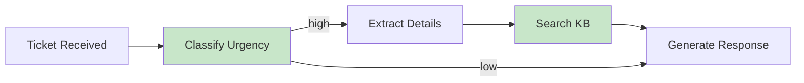

import { LLMPlayground } from '/snippets/LLMPlayground.jsx';
import { CodeEditor } from '/snippets/CodeEditor.jsx';


## Chain-of-Thought (CoT): Making Reasoning Visible

<Note>
  Chain-of-Thought (CoT) is less common with reasoning models, since they already perform an explicit reasoning step. With SLMs and other non-reasoning models, however, CoT can still make a meaningful difference.

  That said, it’s still valuable to learn CoT techniques—they help you understand how these models think and how to effectively influence their behavior.
</Note>

**The Problem:**

<LLMPlayground
  title="Playground: Let's do some math"
  defaultMode="chat"
  defaultInput={`What's 15% tip on a $47.83 bill?`}
  response={`$7.17`}
  height="400px"
  keepInput={true}
/>

But what if you need to debug a wrong answer? You can't see the reasoning. The expected response would be something like (note: the response shown below is a placeholder example, not a real API response):

<LLMPlayground
  title="Playground: Chain-of-Thought"
  defaultMode="advanced"
  defaultMessages={[
    {"role": "system", "content": "Show your reasoning steps briefly before the final answer."},
    {"role": "user", "content": "What's a 15% tip on a $47.83 bill? Think step by step."},
  ]}
  height="400px"
/>

**In Production:**

- Use CoT for complex reasoning; avoid for deterministic extraction/classification at temperature=0.
- Consider privacy/compliance: avoid logging sensitive intermediate reasoning.
- Cost/latency rise with longer outputs—use selectively.

**Why It Works:**

- Often improves performance on reasoning tasks (magnitude varies by task/model)
- Creates "intermediate tokens" that guide the model
- Makes errors debuggable

**Production Pattern:**

<LLMPlayground
  title="Playground: CoT Production Pattern"
  defaultMode="advanced"
  defaultMessages={[
    {"role": "system", "content": "You are a helpful assistant that solves problems step by step."},
    {"role": "user", "content": "<question>What's 15% tip on a $47.83 bill?</question>\n\n<instructions>\nSolve this step by step:\n1. Identify what information you need\n2. Break down the problem into sub-steps\n3. Solve each sub-step\n4. Combine into final answer\n5. Verify your answer makes sense\n</instructions>\n\n<thinking>\n[Your step-by-step reasoning here]\n</thinking>\n\n<final_answer>\n[Your final answer here]\n</final_answer>"}
  ]}
  height="600px"
/>

**Real-World Impact:**

- Code generation: 35% fewer bugs with CoT
- Math problems: 50-70% accuracy improvement
- Medical diagnosis: More reliable clinical reasoning

## Self-Consistency: Voting for Reliability

**The Problem:** One response might be wrong due to non-determinism, ambiguous tasks, and/or valid solution paths.

**The Solution:** Generate multiple responses and vote.
<CodeEditor 
  file="src/prompting/advance_self_consistency.ts"
  functionName="main"
  lines="24-36"
  title="Advanced Self-Consistency"
/> 


**When to Use:**

- High-stakes decisions (medical, financial, legal)
- Complex reasoning where errors are costly
- Classification tasks where confidence matters

**Cost Consideration:**

- 5x Agent tasks = 5x cost
- Use only when accuracy justifies expense

**Performance Data:**

- CoT often improves performance on reasoning benchmarks; magnitude varies by task/model (see Wei et al., 2022)
- Combining CoT + Self-Consistency can yield additional gains; magnitude varies by task/model (see Wang et al., 2022)
- Always validate on your evaluation set; do not assume universal gains

## Extended Thinking: Anthropic's Secret Weapon

**Claude-Specific Feature:** Claude can expose its "thinking" before answering using special tags.

```python Prompt
<thinking>
Let me analyze this complex legal document...
- First, I'll identify the key clauses
- Then, I'll look for any conflicting terms
- Finally, I'll assess risk level
</thinking>

[Your actual task here]
```

**Why This Matters:**

1. **Debugging:** See where reasoning went wrong
2. **Quality:** Forces model to think before answering
3. **Transparency:** Clients can audit AI decisions

**Thinking tags can also be used to guide Claude steps:**

<CodeGroup>


```ts TypeScript
async function analyzeContract(contractText: string): Promise<{
    analysis: any;
    reasoning: string;
}> {
    const prompt = `
<document>
${contractText}
</document>

<thinking>
I need to analyze this contract for:
1. Key obligations
2. Termination clauses
3. Liability limits
4. Red flags

Let me work through each section...
</thinking>

Provide a JSON response with:
- obligations: list of key obligations
- risks: list of potential risks
- recommendations: list of recommended actions
`;
    
    const response = await claude.generate(prompt);
    
    // Parse thinking section for audit trail
    const thinking = extractBetweenTags(response, "thinking");
    const result = extractJson(response);
    
    return {
        analysis: result,
        reasoning: thinking  // Store for compliance/review
    };
}
```

</CodeGroup>

## Prompt Chaining: Breaking Complex Tasks

**Single Prompt Limitations:**

- Context window fills up
- Errors compound
- Hard to debug
- Expensive to retry

**Chaining Solution:** Break one complex task into sequential simple tasks.



<CodeEditor 
  file="src/prompting/prompt_chaining.ts"
  functionName="main"
  lines="127-139"
  title="Prompt Chaining"
/> 

**Benefits:**

- Each step is simple → fewer errors
- Failed steps can retry independently
- Cheaper: Only call expensive steps when needed
- Easier to evaluate and improve

**Trade-off:**

- More latency (sequential calls)
- More complex code
- Multiple LLM calls (but often cheaper overall)

---